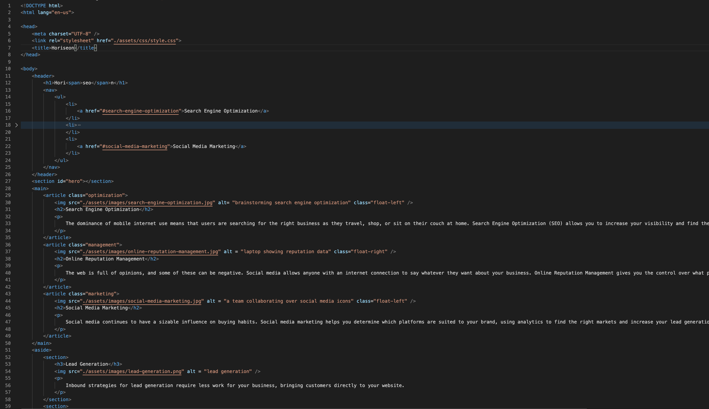

# Horiseon Code Refractor

## Description
This repository is a revision of Horiseon's website design. The company specializes in marketing agency that specializes in online management and social media marketing. They requested support with making their website accessible to all customers including those with disabilities. I also focused on refracting the index and stylesheet to clean up the code and allow for easier management in the future.

## Installation
To view the repository as well as the actual webpage, please use the following link for access.
https://bk7711.github.io/horiseon/ - Horiseon webpage

Below is a preview of the html:

